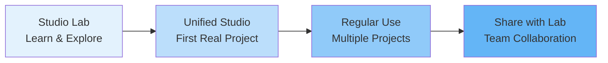
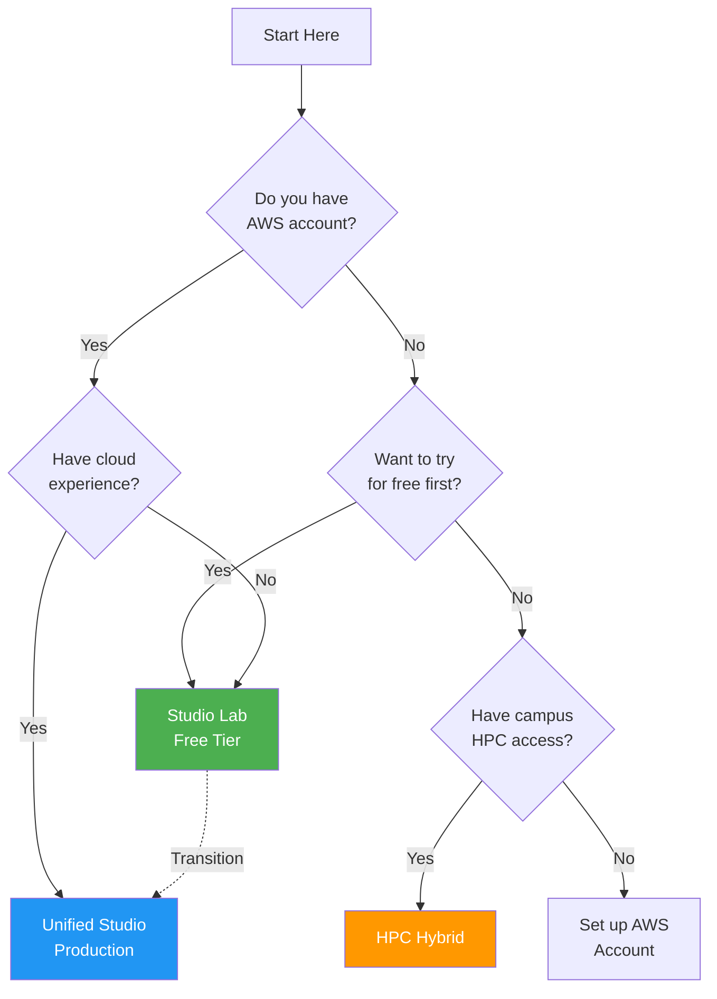

# Getting Started with Research Jumpstart

Welcome! This guide will help you choose the right platform and launch your first research project in the cloud.

## Choose Your Starting Point

Research Jumpstart offers multiple entry points depending on your needs, experience, and resources. Here's how to decide:

### 🆓 Start with Studio Lab (Recommended for Most)

**Best for:**
- First-time cloud users
- Students and early-career researchers
- Learning and prototyping
- Anyone wanting to try before committing

**Why start here:**
- ✅ No AWS account required
- ✅ Completely free, no credit card
- ✅ Start coding in 2 minutes
- ✅ Learn at your own pace
- ✅ Easy transition to production later

**Limitations:**
- 15GB storage limit
- 12-hour session limit
- Sample datasets only
- Single-user (no team features)

[Get Started with Studio Lab →](studio-lab-quickstart.md){ .md-button .md-button--primary }

---

### 🚀 Jump to Unified Studio (Production)

**Best for:**
- Experienced AWS users
- Funded research projects
- Team collaborations
- Publication-ready work

**Why go straight to production:**
- ✅ Full AWS capabilities
- ✅ Unlimited compute and storage
- ✅ Team collaboration features
- ✅ Bedrock AI integration
- ✅ Distributed processing

**Requirements:**
- AWS account (10 min setup)
- Credit card for billing
- Basic cloud computing knowledge
- Budget (~$20-50 per project)

[Set Up AWS Account →](aws-account-setup.md){ .md-button .md-button--primary }

---

### 🔄 Use HPC Hybrid Approach

**Best for:**
- Researchers with existing campus HPC access
- Cost-conscious users
- Institutions with cloud policies

**Why hybrid:**
- ✅ Leverage existing HPC investment
- ✅ Lower cloud costs
- ✅ Best of both worlds
- ✅ Gradual cloud adoption

**How it works:**
- Run heavy compute on campus HPC (free/subsidized)
- Transfer results to cloud for analysis
- Use cloud for collaboration and visualization

[Learn About HPC Hybrid →](../transition-guides/hpc-hybrid.md){ .md-button }

---

## The Typical Journey

Most researchers follow this path:

**Phase 1: Exploration** (1-2 weeks)
- Try 2-3 projects in Studio Lab
- Learn cloud workflows
- Verify approach works for your research
- **Time investment**: 4-8 hours
- **Cost**: $0

**Phase 2: First Production Project** (1-2 weeks)
- Set up AWS account
- Transition one project to Unified Studio
- Run full-scale analysis
- Generate publication-quality results
- **Time investment**: 2-3 days
- **Cost**: $20-50

**Phase 3: Integration** (ongoing)
- Incorporate into regular workflow
- Share with lab members
- Build institutional knowledge
- **Time savings**: Months per project

---

## What You'll Need

### For Studio Lab (Free Tier)

✅ Web browser (Chrome, Firefox, Safari, Edge)
✅ Stable internet connection
✅ Basic Python knowledge (helpful but not required)
✅ 2-4 hours for your first project

❌ No AWS account
❌ No credit card
❌ No installation required

### For Unified Studio (Production)

✅ Everything above, plus:
✅ AWS account (we'll guide you through setup)
✅ Credit card for billing verification
✅ Basic understanding of cloud concepts
✅ Budget for compute/storage (~$20-50/project)

---

## Decision Framework

Still not sure? Use this flowchart:

---

## Quick Reference

| Question | Studio Lab | Unified Studio | HPC Hybrid |
|----------|-----------|----------------|------------|
| **Setup time** | 2 minutes | 1-2 hours | 4-8 hours |
| **Cost** | $0 | $20-50/project | $10-20/project |
| **AWS account needed** | No | Yes | Yes |
| **Credit card needed** | No | Yes | Yes |
| **Data scale** | Samples (<10GB) | Full datasets | Full datasets |
| **Team collaboration** | No | Yes | Yes (via cloud) |
| **Best for learning** | ⭐⭐⭐⭐⭐ | ⭐⭐⭐ | ⭐⭐ |
| **Best for production** | ⭐ | ⭐⭐⭐⭐⭐ | ⭐⭐⭐⭐ |
| **Time to first results** | 2 hours | 1 day | 2-3 days |

[Detailed Platform Comparison →](platform-comparison.md)

---

## Common Questions

??? question "Can I start with Studio Lab and move to production later?"
    **Yes!** This is the recommended path. Every project in Research Jumpstart is designed to work in both Studio Lab (free tier) and Unified Studio (production). We provide detailed [transition guides](../transition-guides/index.md) to help you move seamlessly.

??? question "Will I lose my work when I transition?"
    **No.** All your notebooks, code, and analysis can be transferred via Git. You'll just point to different data sources (S3 instead of local files) and scale up compute. Your code logic remains the same.

??? question "How much will Unified Studio actually cost?"
    **Typical costs**: $20-50 per full analysis run, ~$5-10/month for storage. But this varies based on:
    - Data size
    - Compute time
    - Whether you use spot instances
    - Storage needs

    Use our [cost calculator](../resources/cost-calculator.md) for your specific case.

??? question "What if I don't know Python?"
    **You can still learn!** Our projects include:
    - Extensive code comments
    - Step-by-step explanations
    - Links to learning resources

    Many researchers learn Python by working through our projects. Start with a project in your domain - you'll understand the science, and the Python will make sense in context.

??? question "Can I use my own data?"
    **Yes!** While our projects use public datasets (for easy access), you can adapt them to your own data. Projects include instructions for:
    - Uploading your data to S3
    - Adapting data loading code
    - Handling different data formats

??? question "Is my data secure and private?"
    **Yes.** When you use Unified Studio with your AWS account:
    - Your data stays in your AWS account
    - You control all access permissions
    - AWS provides enterprise-grade security
    - You can enable encryption at rest and in transit

    For sensitive data (HIPAA, GDPR), see our [compliance guide](../resources/compliance.md).

---

## Support & Resources

### 📚 Documentation
- [Platform Comparison](platform-comparison.md) - Detailed comparison of options
- [FAQ](../resources/faq.md) - Frequently asked questions
- [Glossary](../resources/glossary.md) - Cloud computing terms explained

### 🎥 Video Tutorials
- [Studio Lab Walkthrough](../resources/videos.md#studio-lab) (5 min)
- [Your First Project](../resources/videos.md#first-project) (15 min)
- [Transition to Production](../resources/videos.md#transition) (20 min)

### 💬 Community
- [GitHub Discussions](https://github.com/research-jumpstart/research-jumpstart/discussions) - Ask questions
- [Office Hours](../community/office-hours.md) - Live help every Tuesday
- [Success Stories](../community/success-stories.md) - Learn from others

### 🔧 Tools
- [Cost Calculator](../resources/cost-calculator.md) - Estimate your costs
- [Instance Selector](../resources/instance-selector.md) - Choose right compute
- [Setup Scripts](https://github.com/research-jumpstart/research-jumpstart/tree/main/tools/setup-scripts) - Automate setup

---

## Next Steps

Ready to get started? Choose your path:

=== "🆓 Studio Lab (Free)"
    Perfect for trying out cloud computing without commitment.

    [Launch Studio Lab Quickstart →](studio-lab-quickstart.md){ .md-button .md-button--primary }

=== "🚀 Unified Studio (Production)"
    Jump straight to production with full AWS capabilities.

    [Set Up AWS Account →](aws-account-setup.md){ .md-button .md-button--primary }

=== "🔄 HPC Hybrid"
    Use your campus HPC with cloud for analysis.

    [Learn About Hybrid Approach →](../transition-guides/hpc-hybrid.md){ .md-button }

---

**Questions?** Check our [FAQ](../resources/faq.md) or [join the discussion](https://github.com/research-jumpstart/research-jumpstart/discussions).
