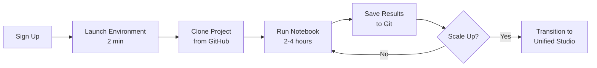
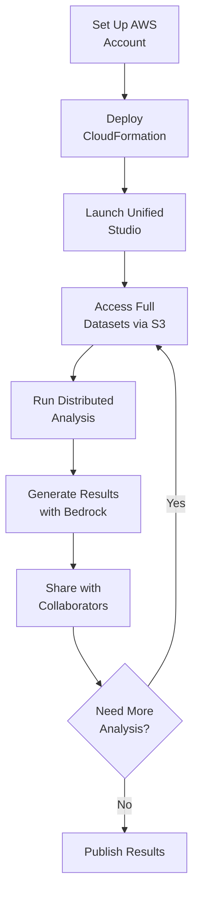
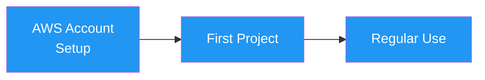

# Platform Comparison: Studio Lab vs Unified Studio vs HPC Hybrid

Choosing the right platform depends on your research needs, budget, and experience. This guide provides an honest, detailed comparison to help you decide.

## Quick Comparison Table

| Feature | Studio Lab | Unified Studio | HPC Hybrid |
|---------|-----------|----------------|------------|
| **💰 Cost** | $0 forever | $20-50/project | $10-20/project |
| **⏱️ Setup Time** | 2 minutes | 1-2 hours | 4-8 hours |
| **🔐 AWS Account** | Not needed | Required | Required |
| **💳 Credit Card** | Not needed | Required | Required |
| **📊 Data Scale** | Samples (<10GB) | Unlimited | Unlimited |
| **💻 Compute** | Single node (CPU/GPU) | Distributed (EMR, Spark) | HPC + Cloud analytics |
| **👥 Team Collaboration** | Personal workspace | Built-in | Via cloud portion |
| **🤖 Bedrock AI** | No | Yes | Yes |
| **⏰ Session Limit** | 12 hours | No limit | No limit |
| **📦 Storage** | 15GB | Elastic (pay per GB) | HPC + Cloud |
| **🚀 Time to First Results** | 2 hours | 1 day | 2-3 days |
| **📈 Best For** | Learning | Production research | Cost optimization |

---

## Studio Lab (Free Tier)

**Amazon SageMaker Studio Lab** provides free Jupyter notebooks with compute and storage - no AWS account required.

### ✅ Strengths

**Perfect for Learning**
- Zero barrier to entry - just sign up and start
- No cost risk - will never receive a bill
- Generous compute - can run substantial analyses
- GPU access available (limited hours)

**Ideal Use Cases**
- 📚 Learning cloud-based research workflows
- 🧪 Prototyping and proof-of-concept
- 🎓 Teaching and coursework
- 🔬 Small-scale analyses (< 10GB data)
- 🎯 Deciding if cloud is right for your research

**Technical Specifications**
- **Compute**: ml.t3.xlarge (4 vCPU, 16GB RAM) or ml.g4dn.xlarge (GPU)
- **Storage**: 15GB persistent
- **Runtime**: 12-hour sessions (auto-save state)
- **Software**: Pre-installed Python, conda, common data science libraries
- **Access**: No VPN required, works from anywhere

### ⚠️ Limitations

**Data Constraints**
- 15GB storage limit (can't fit large datasets)
- No direct S3 access to full-scale data
- Must use sample/subset data

**Compute Constraints**
- Single machine only (no distributed processing)
- 12-hour session timeout (long jobs must checkpoint)
- Shared resources (may be slower during peak times)
- No Bedrock AI integration

**Collaboration Constraints**
- Personal workspace only (can't share live environment)
- No team features or shared projects
- Version control via Git only

**Not Suitable For**
- ❌ Full-scale production analyses
- ❌ Datasets > 10GB
- ❌ Analyses requiring > 12 hours
- ❌ Team collaboration
- ❌ Publication-critical workflows (use for prototyping first)

### 💡 Best Practices

**Maximize Your Studio Lab Experience**

1. **Use Git for Version Control**
   ```bash
   git init
   git remote add origin your-repo-url
   git add .
   git commit -m "Progress checkpoint"
   git push
   ```

2. **Save State Before Timeout**
   - Studio Lab auto-saves notebooks
   - Export results to your repo
   - Use `pickle` or `joblib` to save processed data

3. **Work with Sample Data**
   - Download small subsets of large datasets
   - Use pre-processed data when available
   - Test logic before scaling up

4. **Optimize for CPU**
   - Vectorize operations (NumPy, pandas)
   - Avoid loops where possible
   - Use multiprocessing for parallel tasks

### 🎯 Typical Workflow



**Estimated Time Investment**: 4-8 hours to complete 2-3 projects

[Get Started with Studio Lab →](studio-lab-quickstart.md){ .md-button }

---

## Unified Studio (Production)

**Amazon SageMaker Unified Studio** provides the full AWS platform for production research workflows.

### ✅ Strengths

**Production-Ready**
- Unlimited compute and storage
- Distributed processing (EMR, Spark)
- Auto-scaling based on workload
- Enterprise-grade reliability

**Advanced Capabilities**
- 🤖 **Bedrock AI Integration**: Claude for literature review, report generation
- 📊 **Full Data Access**: Query petabyte-scale datasets without downloads
- ⚡ **Distributed Computing**: Process 100+ models in parallel
- 👥 **Team Collaboration**: Shared projects, notebooks, and results
- 🔐 **Security & Compliance**: HIPAA, SOC 2, GDPR ready
- 📈 **Scalable**: Start small, scale to supercomputer-level

**Ideal Use Cases**
- 📄 Publication-quality research
- 🔬 Large-scale analyses (100GB+ datasets)
- 👥 Multi-investigator projects
- 🏢 Institutional research programs
- 🌍 International collaborations
- ♻️ Reproducible research workflows

**Technical Capabilities**
- **Compute**: Any EC2 instance type (up to 96 vCPU, 768GB RAM)
- **Storage**: Unlimited S3 storage
- **Runtime**: No session limits
- **Data Access**: Direct S3 reads (no downloads)
- **Processing**: EMR for distributed Spark/Dask
- **AI**: Bedrock models (Claude, Titan, etc.)

### ⚠️ Limitations & Considerations

**Cost Management Required**
- Not free - must monitor spending
- Easy to forget running instances (set up auto-shutdown!)
- Data transfer costs can add up
- Requires budget planning

**Learning Curve**
- More complex than Studio Lab
- Need to understand IAM, S3, VPC (basics)
- CloudFormation templates can be intimidating
- Troubleshooting requires AWS knowledge

**Initial Setup Time**
- 1-2 hours for AWS account setup
- Security configuration (MFA, IAM roles)
- Billing alerts and cost controls
- SageMaker domain creation

**Institutional Approval**
- Some universities require IT approval for cloud accounts
- May need to use institutional AWS account
- Compliance review for sensitive data

### 💰 Cost Breakdown (Realistic)

**Typical Research Project Costs**

```
Regional Climate Analysis (20 models, 2 variables, 2 scenarios):

Data Access:
  S3 reads from Open Data: $0
  (AWS Open Data has no transfer fees)

Compute:
  EMR cluster (4 hours):        $12-18 (spot instances)
  OR
  SageMaker notebook (8 hours): $4-6 (ml.m5.xlarge)

Storage:
  S3 (500GB results, 1 month):  $12
  (Using Intelligent-Tiering)

Bedrock (optional):
  Report generation (3-5 queries): $3-5

───────────────────────────────────────
TOTAL per analysis: $20-35
TOTAL per month: $15-20 (ongoing storage)
```

**Cost Optimization Strategies**

1. **Use Spot Instances** (70% savings)
   ```python
   instance_config = {
       'InstanceType': 'ml.m5.xlarge',
       'InstanceMarketOption': 'spot'  # Instead of 'on-demand'
   }
   ```

2. **Configure Auto-Shutdown**
   - Set idle timeout: 60 minutes
   - Never pay for forgotten instances

3. **Use S3 Intelligent-Tiering**
   - Automatically moves data to cheaper tiers
   - Saves ~50% on storage

4. **Right-Size Instances**
   - Start small (t3.medium)
   - Scale up only if needed
   - Don't over-provision

5. **Leverage AWS Open Data**
   - No data access fees
   - No transfer fees
   - Petabytes available

**Cost Comparison**

| Scenario | Cloud Cost | Your Time Saved | Net Benefit |
|----------|-----------|-----------------|-------------|
| Small analysis | $5 | 20 hours × $50/hr = $1,000 | **$995** |
| Medium analysis | $30 | 80 hours × $50/hr = $4,000 | **$3,970** |
| Large analysis | $100 | 200 hours × $50/hr = $10,000 | **$9,900** |

[Detailed Cost Calculator →](../resources/cost-calculator.md)

### 🎯 Typical Workflow



**Estimated Time Investment**:
- Setup (one-time): 4-6 hours
- First project: 2-3 days
- Subsequent projects: 1-2 days each

[Set Up AWS Account →](aws-account-setup.md){ .md-button }

---

## HPC Hybrid (Best of Both Worlds)

Use your existing campus HPC for heavy compute, cloud for analysis and collaboration.

### ✅ Strengths

**Cost Optimization**
- Heavy compute stays on free/subsidized HPC
- Only pay for cloud analysis and storage
- Typically 50-70% cheaper than full cloud

**Leverage Existing Infrastructure**
- Use familiar HPC environment
- No need to rewrite job scripts
- Keep data on campus (if required)

**Flexibility**
- Graduate to cloud at your own pace
- Mix and match based on workload
- Easier institutional approval

**Ideal Use Cases**
- 🏛️ Researchers with good HPC access (no queue, good support)
- 💰 Cost-conscious projects
- 🔐 Data that must stay on-premises
- 🎓 Teaching (HPC for compute, cloud for visualization)
- 🔄 Transitioning from HPC to cloud gradually

### ⚠️ Limitations

**Added Complexity**
- Manage two environments
- Data transfer between HPC and cloud
- Two sets of credentials/access
- More moving parts

**Data Transfer Time**
- Transferring large results (500GB) takes hours
- Network bandwidth varies by institution
- May hit data caps or transfer limits

**Partial Cloud Benefits**
- Don't get full distributed cloud processing
- Team collaboration only for post-processed results
- Can't leverage cloud auto-scaling for compute

**Setup Complexity**
- Need to configure both environments
- Set up AWS CLI on HPC
- Coordinate job submission and data sync
- More troubleshooting surface area

### 💰 Cost Breakdown

**Hybrid Workflow Costs**

```
Regional Climate Analysis (HPC + Cloud):

Heavy Compute (on HPC):
  Model runs: $0 (institutional)
  Preprocessing: $0 (institutional)
  Storage during compute: $0 (institutional)

Cloud Portion:
  Data transfer to S3 (500GB): $4
  S3 storage (1 month): $12
  Analysis notebooks: $3-5
  Bedrock report generation: $3
  Visualization/dashboards: $2

───────────────────────────────────────
TOTAL per analysis: $24-26
TOTAL per month: $15 (storage)

Compare to:
  Full Cloud: $35
  Savings: ~30%
```

### 🎯 Typical Workflow


**Implementation Steps**

1. **On Campus HPC**: Run simulations
   ```bash
   # Submit job
   sbatch run_models.sh

   # After completion, sync to S3
   module load aws-cli
   aws s3 sync /scratch/results/ s3://my-results/
   ```

2. **In Unified Studio**: Analyze results
   ```python
   # No download needed - query directly
   import s3fs
   fs = s3fs.S3FileSystem()
   data = xr.open_dataset('s3://my-results/output.nc')
   ```

3. **Share with Collaborators**: Via cloud dashboard

[HPC Hybrid Setup Guide →](../transition-guides/hpc-hybrid.md){ .md-button }

---

## Decision Matrix

### Choose Studio Lab If...

✅ You're new to cloud computing
✅ You want to learn with zero risk
✅ Your data is < 10GB
✅ You're prototyping a workflow
✅ You're teaching a course
✅ You want to evaluate before committing

### Choose Unified Studio If...

✅ You have budget for cloud computing
✅ Your datasets are > 10GB
✅ You need distributed processing
✅ You're publishing results soon
✅ You collaborate with external teams
✅ Time is more valuable than cost

### Choose HPC Hybrid If...

✅ You have good campus HPC access
✅ You want to minimize cloud costs
✅ Data must stay on-premises initially
✅ You're transitioning gradually to cloud
✅ You want best cost-performance ratio

---

## Migration Paths

### Path 1: Free to Production (Most Common)


- **Timeline**: 3-4 weeks
- **Cost**: $0 → $20-50/project
- **Success Rate**: 80%+ complete transition

[Transition Guide →](../transition-guides/studio-lab-to-unified.md)

### Path 2: Direct to Production



- **Timeline**: 1 week
- **Best For**: Experienced AWS users
- **Recommended**: Try Studio Lab first anyway (2 hours well spent)

### Path 3: HPC to Hybrid to Full Cloud


- **Timeline**: 6-12 months gradual transition
- **Best For**: Institutions with cloud policies
- **Cost**: Gradually shift as needed

---

## Real-World Examples

### Example 1: Graduate Student (Studio Lab → Unified Studio)

**Lisa, PhD Student in Climate Science**

- **Month 1**: Learned with Studio Lab (free)
  - Completed 3 sample projects
  - Proved approach works for dissertation
  - $0 cost

- **Month 2-6**: Used Unified Studio for research
  - 4 major analyses for dissertation
  - Each analysis: $25 average
  - Total cost: $100 for 6 months
  - **Value**: Saved 5 months vs traditional approach

- **Result**: Graduated on time, published 2 papers

### Example 2: Professor (HPC Hybrid)

**Dr. Martinez, Genomics Lab**

- **Setup**: 1 week (grad student learned cloud)
- **Workflow**:
  - Sequencing on campus HPC (free)
  - Transfer to S3: $5/month
  - Analysis in Unified Studio: $15/month
  - Total: $20/month

- **Compare to full cloud**: $60/month
- **Savings**: $480/year

- **Bonus**: External collaborators can access cloud dashboards

### Example 3: Research Center (Institutional Deployment)

**State Climate Research Center**

- **Setup**: Shared AWS account for 15 researchers
- **Cost**: $200/month average
  - Centralized billing
  - Bulk AWS credits negotiated
  - Cost allocation tags per researcher

- **Previous**: Each researcher struggling with laptops
- **Now**: Unified workflows, shared resources, faster publications

---

## Frequently Asked Questions

??? question "Can I switch between platforms?"
    **Yes!** All Research Jumpstart projects work across platforms. Code is portable via Git. The main differences are:
    - Data access (sample vs full dataset)
    - Compute scale (single vs distributed)
    - Features (basic vs advanced)

??? question "What if I run out of Studio Lab storage?"
    **Options**:
    1. Clean up old projects (download important results first)
    2. Use Git LFS for large files
    3. Transition to Unified Studio for more storage
    4. Keep only notebooks, download data locally

??? question "How do I prevent surprise bills in Unified Studio?"
    **Set up billing alerts**:
    1. Go to AWS Billing Dashboard
    2. Create budget with $50 threshold
    3. Set email alerts at 80% and 100%
    4. Configure auto-shutdown for idle instances

    Most researchers set alerts at $50/month and never hit them.

??? question "Can I use Unified Studio without Bedrock?"
    **Yes!** Bedrock is optional. You can use Unified Studio just for:
    - Distributed computing
    - Large dataset access
    - Team collaboration
    - Scale and storage

    Bedrock adds ~$3-5 per project if you use it.

??? question "Is HPC hybrid worth the extra complexity?"
    **Depends on your situation**:
    - Good HPC access + cost concerns = **Yes**
    - Poor HPC access (long queues) = **No, go full cloud**
    - Good HPC + cloud curious = **Yes, great transition**

---

## Ready to Choose?

=== "🆓 Studio Lab"
    Perfect for learning and exploration

    [Get Started with Studio Lab →](studio-lab-quickstart.md){ .md-button .md-button--primary }

=== "🚀 Unified Studio"
    Ready for production research

    [Set Up AWS Account →](aws-account-setup.md){ .md-button .md-button--primary }

=== "🔄 HPC Hybrid"
    Leverage existing HPC investment

    [Learn About Hybrid →](../transition-guides/hpc-hybrid.md){ .md-button }

---

**Still not sure?** [Join the discussion](https://github.com/research-jumpstart/research-jumpstart/discussions) and ask the community!
