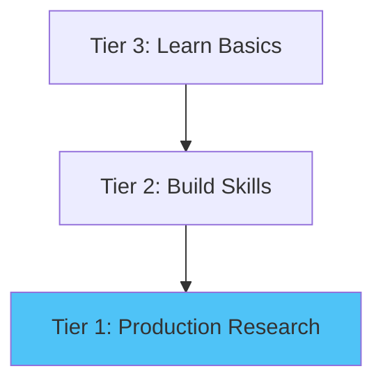

# Tier 1: Flagship Projects

**Production-ready research platforms** (4-5 days) with advanced features including AI integration, distributed computing, and team collaboration.

## Overview

Tier 1 projects represent the pinnacle of cloud-based scientific computing in Research Jumpstart. These are showcase projects demonstrating the full capabilities of AWS infrastructure for research.

### Key Features

✅ **AI-Enhanced Analysis** - Amazon Bedrock integration for intelligent insights
✅ **Distributed Computing** - Multi-node parallel processing
✅ **Production Code** - Industrial-strength, maintainable workflows
✅ **Team Collaboration** - Multi-user environments and version control
✅ **Cost Optimized** - Spot instances, auto-scaling, S3 lifecycle policies
✅ **Publication Ready** - Complete documentation and visualizations

### Time Commitment: 4-5 days
- Day 1: Setup and data ingestion
- Day 2-3: Core analysis pipeline
- Day 4: Advanced features and optimization
- Day 5: Visualization and reporting

### Cost Range: $20-50 per complete analysis

## Available Projects

### 🌍 Climate Science - Ensemble Analysis

**Analyze 20+ climate models without downloading data**

The most comprehensive climate analysis workflow, with AI-assisted interpretation via Amazon Bedrock.

**Features:**
- Multi-model CMIP6 ensemble analysis
- Zarr-optimized S3 data access (no downloads!)
- Distributed computation with Dask
- AI interpretation of climate signals
- Interactive visualization dashboard

**Use Cases:**
- Climate change research
- Model intercomparison projects
- Impact assessments
- Policy analysis

**Cost:** ~$20 for full analysis

[**View Project →**](climate-science.md){ .md-button .md-button--primary }
[GitHub →](https://github.com/research-jumpstart/research-jumpstart/tree/main/projects/climate-science/ensemble-analysis){ .md-button }

---

### 📱 Social Media Analysis

**Distributed social network analysis at scale**

Process millions of posts with sentiment analysis, influence detection, and community discovery.

**Features:**
- Graph analytics at scale (NetworkX + Dask)
- NLP pipeline with transformers
- Streaming data ingestion
- Influence and community detection
- Real-time dashboard

**Use Cases:**
- Social science research
- Misinformation tracking
- Political communication
- Public health messaging

**Cost:** ~$30 for full pipeline

[**View Project →**](social-media.md){ .md-button .md-button--primary }
[GitHub →](https://github.com/research-jumpstart/research-jumpstart/tree/main/projects/social-science/social-media-analysis){ .md-button }

---

### 🏥 Medical Image Classification

**HIPAA-compliant medical image analysis**

Train deep learning models on CT/MRI/X-ray data with secure, compliant workflows.

**Features:**
- HIPAA-compliant data handling
- Multi-modal image support (DICOM)
- Transfer learning (ResNet, EfficientNet)
- Explainability (GradCAM, SHAP)
- Model versioning with MLflow

**Use Cases:**
- Radiology AI research
- Disease detection
- Medical device development
- Clinical decision support

**Cost:** ~$50 with GPU training

[**View Project →**](medical-imaging.md){ .md-button .md-button--primary }
[GitHub →](https://github.com/research-jumpstart/research-jumpstart/tree/main/projects/medical/image-classification){ .md-button }

---

## Why Tier 1?

### When to Choose Tier 1

Choose Tier 1 projects when you:
- ✅ Have production research needs
- ✅ Need AI-enhanced insights
- ✅ Require distributed computing for large-scale data
- ✅ Want team collaboration features
- ✅ Need to demonstrate cloud capabilities to funders
- ✅ Are ready for 4-5 days of focused work

### Advantages Over Lower Tiers

**vs. Tier 3 (Starter):**
- 100x more data
- AI-powered insights
- Production-grade code
- Team workflows

**vs. Tier 2 (Complete):**
- Distributed computing
- AI integration (Bedrock)
- Advanced optimization
- Showcase-quality

## Technical Architecture

All Tier 1 projects use **SageMaker Unified Studio** with:

- **Compute**: SageMaker Processing, Training, or EMR
- **Storage**: S3 with intelligent tiering
- **AI**: Amazon Bedrock for Claude/GPT
- **Collaboration**: Git integration, shared environments
- **Monitoring**: CloudWatch dashboards
- **Cost Control**: Spot instances, auto-shutdown

## Deployment

### Prerequisites

- AWS Account with appropriate permissions
- Basic AWS knowledge (S3, IAM)
- Domain expertise for your research area
- Budget: $20-50 per full analysis run

### Quick Start

1. **Setup**: Follow project-specific setup guide
2. **CloudFormation**: Deploy stack (one-click)
3. **Configure**: Set parameters (data sources, compute)
4. **Run**: Execute main workflow
5. **Monitor**: Track progress in dashboard
6. **Results**: Export findings and visualizations

Detailed instructions in each project's documentation.

## Learning Path

### Recommended Progression

**Suggested Path:**
1. Start with related Tier 3 project (2-4 hours)
2. Progress to Tier 2 for full workflow (2-3 days)
3. Deploy Tier 1 for production needs (4-5 days)

**Or jump directly** if you have:
- Cloud computing experience
- Large-scale research needs
- Team collaboration requirements
- Publication deadlines

## Support

Tier 1 projects include priority support:

- 📧 **Email**: tier1-support@researchjumpstart.org
- 💬 **Slack**: #tier1-projects channel
- 📅 **Office Hours**: Dedicated Tier 1 sessions
- 🎥 **Video Tutorials**: Complete walkthroughs
- 📚 **Documentation**: Detailed architecture guides

## Success Stories

> "The Climate Ensemble project cut our analysis time from 3 weeks to 3 days. The AI interpretation via Bedrock caught a signal we would have missed."
>
> — Dr. Sarah Kim, Climate Scientist, Arizona State University

> "Running social network analysis on 5 million posts was impossible locally. The Tier 1 workflow made it routine."
>
> — Prof. James Chen, Computational Social Science, MIT

[Read more success stories →](../../community/success-stories.md)

## Cost Management

### Typical Costs by Project

| Project | Full Analysis | Per-Run | Monthly (4 runs) |
|---------|---------------|---------|------------------|
| Climate Science | $20 | $20 | $80 |
| Social Media | $30 | $30 | $120 |
| Medical Imaging | $50 | $40-60 | $180 |

**Cost Factors:**
- Data volume
- Compute time
- Storage duration
- AI/Bedrock usage

### Cost Optimization Tips

✅ Use Spot Instances (50-70% savings)
✅ S3 lifecycle policies (archive old data)
✅ Auto-shutdown idle resources
✅ Right-size compute (start small)
✅ Clean up after runs

[Cost Calculator →](../../resources/cost-calculator.md)

## Next Steps

Ready to deploy a Tier 1 project?

1. **[Choose Your Project](#available-projects)** - Pick based on research domain
2. **[AWS Setup Guide](../../getting-started/aws-account-setup.md)** - Prepare your account
3. **[Follow Project Guide](climate-science.md)** - Detailed instructions
4. **[Join Community](../../community/index.md)** - Get support

Or:
- [Compare with Tier 2](../tier2/index.md)
- [Start with Tier 3](../tier3/index.md)
- [Understand Tiers](../tiers.md)

---

**Questions?** Ask in [GitHub Discussions](https://github.com/research-jumpstart/research-jumpstart/discussions) or join [office hours](../../community/office-hours.md). 🚀
