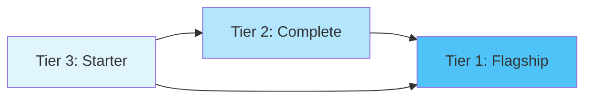

# Understanding Project Tiers

Research Jumpstart organizes projects into three tiers based on complexity, time commitment, and learning objectives. This tiered approach helps you choose the right starting point for your research journey.

## Overview

| Tier | Name | Duration | Projects | Best For |
|------|------|----------|----------|----------|
| **1** | Flagship | 4-5 days | 3 | Production research workflows |
| **2** | Complete | 2-3 days | 11 | Full domain analysis |
| **3** | Starter | 2-4 hours | 7 | Learning fundamentals |

## Tier 3: Starter Projects (2-4 hours)

### Purpose
Educational tutorials designed to teach fundamental concepts and analysis techniques in specific domains. Perfect for students, workshops, and quick explorations.

### Characteristics
- ✅ **Quick to complete**: 2-4 hours from start to finish
- ✅ **Self-contained**: All data and code included
- ✅ **Educational focus**: Step-by-step with explanations
- ✅ **Studio Lab compatible**: Run for free, no AWS account needed
- ✅ **Foundation building**: Core concepts before scaling up

### What You'll Learn
- Domain-specific analysis fundamentals
- Python data science workflow
- Visualization techniques
- Statistical methods
- Interpretation of results

### Available Projects

#### 🔬 **Physics - Gravitational Waves**
Detect binary black hole mergers using matched filtering and signal processing.

- **Topics**: Signal processing, FFT, spectrograms, matched filtering
- **Methods**: Post-Newtonian approximation, SNR calculation
- **Dataset**: Simulated LIGO-like gravitational wave events
- **Output**: Event detection, parameter estimation

[View Project →](tier3/physics.md)

---

#### 📊 **Economics - Time Series Analysis**
Forecast macroeconomic indicators using ARIMA models and Granger causality.

- **Topics**: Stationarity testing, ARIMA, forecasting, causality
- **Methods**: ADF, KPSS, Granger tests, confidence intervals
- **Dataset**: Quarterly GDP, inflation, unemployment (2020-2025)
- **Output**: Economic forecasts, causal relationships

[View Project →](tier3/economics.md)

---

#### 🧠 **Psychology - Survey Analysis**
Analyze personality inventories using psychometric methods and factor analysis.

- **Topics**: Cronbach's alpha, reliability, factor analysis
- **Methods**: Internal consistency, EFA, correlation analysis
- **Dataset**: Big Five personality inventory (30 participants)
- **Output**: Reliability scores, personality profiles

[View Project →](tier3/psychology.md)

---

#### 🎓 **Education - Learning Analytics**
Predict student success using logistic regression and performance metrics.

- **Topics**: Educational data mining, prediction, feature importance
- **Methods**: Logistic regression, ROC curves, confusion matrices
- **Dataset**: Student performance data (30 students)
- **Output**: Pass/fail prediction, intervention recommendations

[View Project →](tier3/education.md)

---

#### 🌱 **Environmental Science - Ecology Modeling**
Simulate predator-prey dynamics using Lotka-Volterra equations.

- **Topics**: Population dynamics, ODEs, equilibrium analysis
- **Methods**: Numerical integration, phase space, vector fields
- **Dataset**: Rabbit-fox population data (11 years)
- **Output**: Population forecasts, stability analysis

[View Project →](tier3/environmental.md)

---

#### 💎 **Materials Science - Crystal Structure**
Analyze crystallographic data and predict material properties.

- **Topics**: Crystallography, structure-property relationships, clustering
- **Methods**: Unit cell calculations, K-means, PCA, linear regression
- **Dataset**: 10 materials with lattice parameters
- **Output**: Material classification, density prediction

[View Project →](tier3/materials.md)

---

#### 🧬 **Neuroscience - Brain Imaging**
Analyze fMRI data for functional connectivity and network analysis.

- **Topics**: BOLD signals, functional connectivity, brain networks
- **Methods**: Correlation matrices, network graphs, hierarchical clustering
- **Dataset**: 8 brain regions, 50 time points
- **Output**: Connectivity maps, activation patterns

[View Project →](tier3/neuroscience.md)

---

## Tier 2: Complete Projects (2-3 days)

### Purpose
Comprehensive domain-specific workflows suitable for actual research projects. These provide full analysis pipelines from data ingestion to publication-ready results.

### Characteristics
- ✅ **Research-ready**: Real scientific workflows
- ✅ **Complete pipeline**: End-to-end analysis
- ✅ **Scalable**: Works with larger datasets
- ✅ **Multiple approaches**: Various analysis methods
- ✅ **Production code**: Reusable and maintainable

### What You'll Learn
- Complete research workflow design
- Data preprocessing and quality control
- Multiple analysis approaches
- Result interpretation and visualization
- Best practices for reproducibility

### Available Projects

#### 🧬 **Genomics - Variant Analysis**
Process whole genome sequencing data from FASTQ to annotated variants.

- **Unified Studio**: ✅ Production-ready with CloudFormation
- **Topics**: NGS pipelines, variant calling, annotation
- **Scale**: Chromosome to whole genome
- [View Project →](tier2/genomics.md)

#### 📚 **Digital Humanities - Text Analysis**
Large-scale historical text analysis with network visualization.

- **Unified Studio**: ✅ Production-ready with CloudFormation
- **Topics**: NLP, topic modeling, network analysis
- **Scale**: Thousands of historical documents
- [View Project →](tier2/digital-humanities.md)

#### 🧪 **Chemistry - Molecular Dynamics**
Simulate molecular systems and analyze trajectories.

- **Topics**: MD simulations, free energy, RMSD analysis
- **Scale**: Small molecules to proteins
- [View Project →](tier2/chemistry.md)

#### 🔭 **Astronomy - Exoplanet Detection**
Find exoplanets in Kepler light curves using transit methods.

- **Topics**: Time series, transit detection, orbital mechanics
- **Scale**: Multiple stellar targets
- [View Project →](tier2/astronomy.md)

#### 🌾 **Agriculture - Crop Yield Prediction**
Predict agricultural yields from satellite and weather data.

- **Topics**: Remote sensing, ML regression, feature engineering
- **Scale**: Regional to national
- [View Project →](tier2/agriculture.md)

#### 💉 **Public Health - Epidemiology**
Model disease spread and intervention strategies.

- **Topics**: SIR/SEIR models, outbreak analysis, forecasting
- **Scale**: Local to national outbreaks
- [View Project →](tier2/public-health.md)

#### 🏙️ **Urban Planning - Transportation Analysis**
Analyze urban mobility patterns and optimize transit.

- **Topics**: Network analysis, flow optimization, accessibility
- **Scale**: City-wide transportation systems
- [View Project →](tier2/urban-planning.md)

#### 🗣️ **Linguistics - Corpus Analysis**
Large-scale linguistic analysis of text corpora.

- **Topics**: Corpus linguistics, frequency analysis, collocations
- **Scale**: Millions of words
- [View Project →](tier2/linguistics.md)

#### 🏺 **Archaeology - Artifact Classification**
Classify and analyze archaeological artifacts using ML.

- **Topics**: Image classification, morphometrics, provenance
- **Scale**: Thousands of artifacts
- [View Project →](tier2/archaeology.md)

#### 🌊 **Marine Science - Ocean Modeling**
Model ocean dynamics and marine ecosystems.

- **Topics**: Hydrodynamics, ecosystem modeling, climate effects
- **Scale**: Regional ocean basins
- [View Project →](tier2/marine-science.md)

#### ⚡ **Energy Systems - Renewable Optimization**
Optimize renewable energy systems and grid integration.

- **Topics**: Energy modeling, optimization, forecasting
- **Scale**: Facility to grid-scale
- [View Project →](tier2/energy-systems.md)

---

## Tier 1: Flagship Projects (4-5 days)

### Purpose
Comprehensive, production-ready research platforms that demonstrate the full power of cloud-based scientific computing. These are showcase projects with advanced features like AI integration, distributed computing, and team collaboration.

### Characteristics
- ✅ **Production-grade**: Industrial-strength code
- ✅ **AI-enhanced**: Amazon Bedrock integration for insights
- ✅ **Distributed**: Parallel processing across multiple nodes
- ✅ **Collaborative**: Multi-user workflows
- ✅ **Cost-optimized**: Spot instances, auto-scaling
- ✅ **Publication-ready**: Complete documentation and figures

### What You'll Learn
- Advanced cloud architecture
- AI-assisted research workflows
- Distributed computing patterns
- Cost optimization strategies
- Team collaboration tools
- Production deployment

### Available Projects

#### 🌍 **Climate Science - Ensemble Analysis**
Analyze 20+ climate models without downloading data, with AI interpretation.

- **Unified Studio**: ✅ Full production deployment
- **Features**: Multi-model analysis, Bedrock AI, S3 optimization
- **Scale**: CMIP6 ensemble, multiple scenarios
- **Cost**: ~$20 for complete analysis
- [View Project →](tier1/climate-science.md)

#### 📱 **Social Media Analysis**
Distributed social network analysis with sentiment and influence detection.

- **Unified Studio**: ✅ Full production deployment
- **Features**: Graph analytics, NLP pipelines, streaming ingestion
- **Scale**: Millions of posts, complex networks
- **Cost**: ~$30 for full pipeline
- [View Project →](tier1/social-media.md)

#### 🏥 **Medical Image Classification**
HIPAA-compliant medical image analysis with deep learning.

- **Features**: Secure workflows, model training, explainability
- **Scale**: Hospital-scale datasets, multiple modalities
- **Cost**: ~$50 with GPU training
- [View Project →](tier1/medical-imaging.md)

---

## Choosing Your Tier

### Start with Tier 3 if you...
- ✅ Are new to the domain or cloud computing
- ✅ Want to complete something in a few hours
- ✅ Are teaching or learning fundamentals
- ✅ Need to explore before committing resources
- ✅ Don't have an AWS account (Studio Lab)

### Move to Tier 2 if you...
- ✅ Have domain knowledge and research questions
- ✅ Need complete analysis pipelines
- ✅ Are working with real datasets
- ✅ Want reusable research workflows
- ✅ Are ready for 2-3 days of focused work

### Jump to Tier 1 if you...
- ✅ Have production research needs
- ✅ Need AI-enhanced insights
- ✅ Require distributed computing
- ✅ Are working with large-scale data
- ✅ Want to demonstrate cloud capabilities
- ✅ Have team collaboration requirements

## Progression Path

**Recommended progression:**
1. Start with a Tier 3 project in your domain
2. Graduate to Tier 2 for full research workflows
3. Leverage Tier 1 for production deployments

**Or skip ahead:** If you're already experienced, jump directly to the tier that matches your needs.

## Deployment Comparison

| Feature | Tier 3 | Tier 2 | Tier 1 |
|---------|--------|--------|--------|
| **Platform** | Studio Lab (free) | Studio Lab or AWS | Unified Studio (AWS) |
| **Compute** | Single notebook | Notebook or jobs | Distributed jobs |
| **AI Integration** | ❌ | ❌ | ✅ Bedrock |
| **Collaboration** | Individual | Individual | Team workflows |
| **Data Scale** | Sample datasets | MB to GB | GB to TB |
| **Cost** | $0 | $0-10 | $20-50 |
| **Time** | 2-4 hours | 2-3 days | 4-5 days |

## Next Steps

Ready to get started?

1. **[Browse All Projects](index.md)** - See the full catalog
2. **[Platform Comparison](../getting-started/platform-comparison.md)** - Choose your deployment
3. **[Your First Project](../getting-started/first-project.md)** - Step-by-step guide
4. **[Studio Lab Quickstart](../getting-started/studio-lab-quickstart.md)** - Launch for free

---

*Need help choosing? Join our [office hours](../community/office-hours.md) or ask in [discussions](https://github.com/research-jumpstart/research-jumpstart/discussions).*
